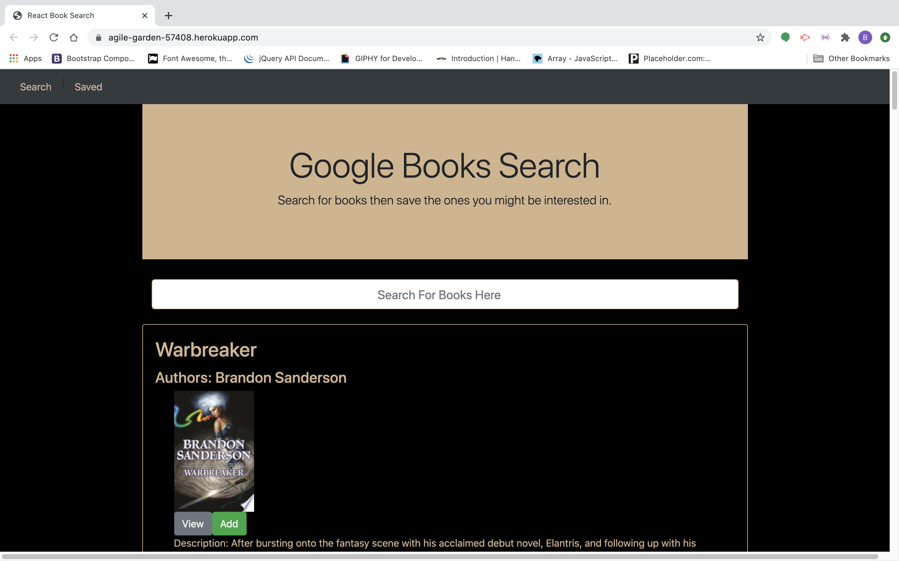

# Google Books Search
  
## Description
  This app lets users search for books and save the ones they like.

## Table of Contents

* [Project URL](#project-url)
* [Installation](#installation)
* [License](#license)
* [Contribute](#contribute)
* [Usage](#usage)
* [Questions](#questions)

## Project URL
  Repository: https://github.com/Brendon-Ravn/Google-Books-Search
   
  Deployed App: https://agile-garden-57408.herokuapp.com/
   
   

## Installation 
  axios, express, if-env, mongoose, bootstrap, react, react-dom, react-router-dom, react-scripts
   
   

## License 
  MIT
   
   

## Contribute
  Email Me
   

## Usage
  Search for a book then you can either view a book on the Google Books website or save it to your own list to look at later.
   
   
  
   
   

## Questions
  My email: b.conatser21@gmail.com
   
  My GitHub: Brendon-Ravn
